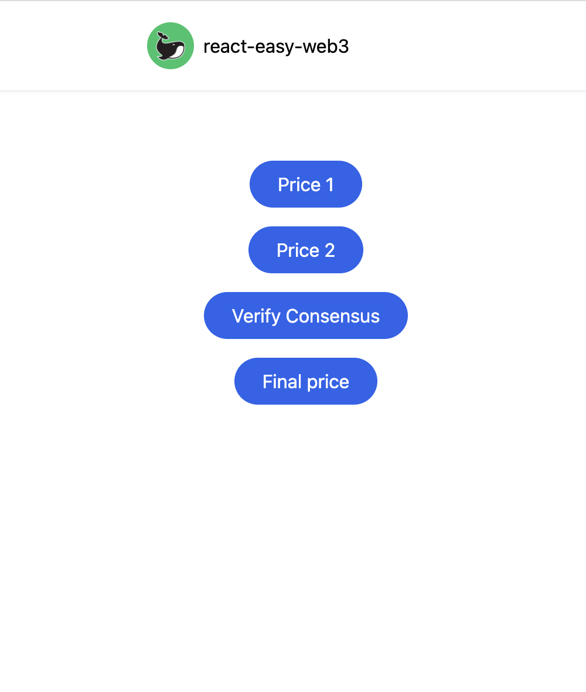

⚡️ FEEDATA Personalized data feeds for a more robust oracle experience  

# Inspiration
Our inspiration stems from the problems that current oracles have. When a smartcontract needs data from outside of the blockchain it resides on, it needs to call an oracle. When the data is widely used, robust solutions exist, but not for all data.
For example, a smart contract needing localized sport results might have to call an oracle but only use it to make a single api call. This is not very reliant, and can easily be gamed if the api endpoint is corrupted.
We can compare it to Chainlink’s data feeds, but more permissive and open to any one, just as any framework.

# What it does
Feedata is a framework working with iExec’s Oracle Factory, to help create personalized but reliable oracles.

We take several oracle responses to compute the median response, without taking into account any unreasonable one.

The first implementation is to create data feeds on iExec sidechain, using the median of several API answers, with the calculation made in the transparency of On-Chain compute.
Another implementation is aggregate the sport result of several API, in order to get a reasonably sure and reliable answer. This is useful to create sport betting dapps, but a similar approach can be used to settle any prediction market.

For example, let's say someone wants to create a prediction market on the outcome of a local election. Oracles based on this precise query won’t be available, and just querying one API isn’t reliable and can be gamed by the API creator. However, querying a diversified pool of oracles and merging their answers to decide if the outcome of the market is final, allow the systems to be more secure.

# How we built it

To achieve this, the contract calls several oracle making different API calls, but for the same data result.
Once all the calls are received, Feedata aggregates them and uses a specific consensus model to check the data, and create his own result.

We aggregated the data from snapshot and discourse forms to showcase how delegates can view proposals and votes in a single page. We used typescript and react on the front-end and graphQL to fetch the discourse data.

# Challenges we ran into

Time: We didn't have enough time to develop, especially for the frontend as it was a new skill to learn for the team.
Acces: We had difficulties getting all the different access : Getting whitelisted on iExec’s PoA sidechain, but mostly api keys to all the different api we wanted to use.

# Accomplishments that we're proud of

We are a somewhat last-minute entry to the hackathon but we managed to focus on our concept.
The main issue was getting the right access but we were able to try to focus on another protocol to test, while evolving the idea and seeing more potential applications.
The challenges we ran into allowed us to really extend our ideas in a more global way, with the intention to add the usage of multiple oracle services.

# What we learned

Continuous communication between the team is essential for success. Even having one or two meetings a day to discuss the progress helped a lot. Task management and Time management are one of the most essential things for succeeding in a hackathon.
What's next for Feedata
Trello-like dashboard for Oracle services and consensus type to help integrate a large variety of those.
Ability to track current active consensus implemented & ways to deploy them in a no-code setting.
Dashboard with the different data feeds created by other people.
Getting whitelisted on iExec to test our smartcontract code, and implement it with chainlink’s external adaptors (already have a node running during the night, but didn’t have the time to test with creation of jobs)

# Built With

solidity
iExec
javascript
react
Chainlink
typescript
Try it out

## Features & Plugins

- React, [Vite](https://github.com/vitejs/vite), ESlint - born with fastness

- [web3model](https://github.com/Web3Modal/web3modal)

- [ethers.js](https://github.com/ethers-io/ethers.js)
  
- i18n, store - works out-of-box

- [TailwindCSS](https://github.com/tailwindlabs/tailwindcss) - CSS framework for rapid UI development

- TypeScript

## ScreenShot

   

## Usage

1. Clone this repository
2. npm install
3. npm run dev

# Author

Spoyte
Diazac
